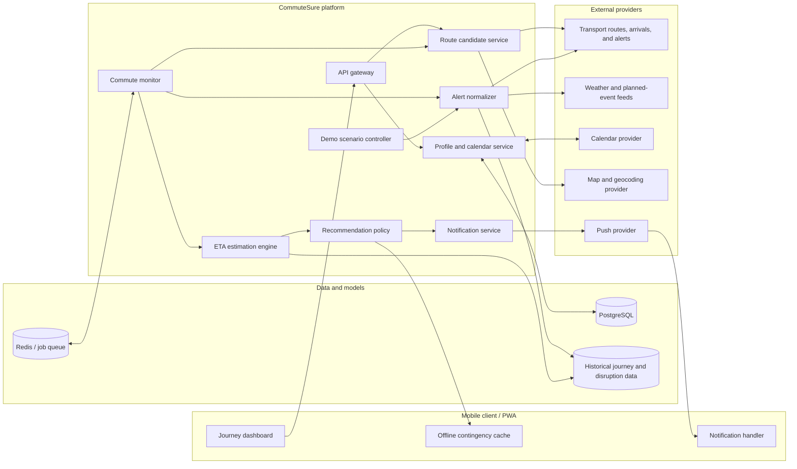

# CommuteSure SG

> A proactive commuting companion that tells Singapore commuters what to do when a journey becomes uncertain - not just how long it should take.

## The problem

When an MRT disruption, heavy rain, or an unexpected closure affects a commute, travellers have to piece together information from several sources: transport alerts, bus timings, route planners, weather forecasts, and their own calendar. Existing navigation apps are good at estimating a normal journey, but an ETA alone does not answer the question commuters actually care about:

> **Should I wait, leave earlier, or reroute if I must arrive by a specific time?**

CommuteSure SG continuously evaluates a planned journey and recommends one clear action. Every route is shown with a plain estimated arrival time (ETA), how many minutes early or late that is against the user's target, and the adult card fare, so the trade-off is readable at a glance.

## Example

Rachel travels from Tampines to Raffles Place every weekday and needs to arrive by 8:45 AM.

On a normal morning, the app stays quiet and confirms:

> Everything looks normal. Leave at 7:40 AM.

When an East-West Line signalling fault occurs, CommuteSure recalculates her options:

- Stay on the East-West Line: arrive **8:50 AM**, about 15 minutes late against her 8:35 AM target.
- Switch at Bugis to the Downtown Line: arrive **8:30 AM**, about 5 minutes early.

It sends a single actionable notification:

> Switch at Bugis to the Downtown Line. You arrive about 20 min sooner at 08:30, on time. Act before 08:06.

## Why it is different

Most journey planners only list routes. CommuteSure compares each route's ETA against **the time the commuter actually has to arrive**, and speaks up only when switching is worth it.

- **ETA against a deadline:** every route shows its arrival time and the minutes early or late against the target, not a bare duration.
- **Price next to time:** adult card fares, time-of-day discounts, and a best-value pick sit beside each ETA.
- **Wait-versus-reroute decisions:** compares the value of staying put against switching routes now.
- **Proactive but quiet:** alerts only when the current route is expected to miss the target and another route saves at least 10 minutes.
- **Deadline-aware:** uses calendar events, arrival buffers, and saved places to plan automatically.
- **Underground-ready:** saves a compact contingency plan before connectivity is lost.
- **Explainable:** shows why a recommendation changed and how much it improves the outcome.

## Hackathon MVP

The MVP deliberately focuses on one memorable capability: **making a reliable wait-or-reroute decision during a disruption**.

### In scope

1. Save one recurring commute, arrival deadline, and preferred buffer.
2. Generate a small set of walking, MRT, and bus route candidates.
3. Ingest normal travel times and a simulated or live disruption alert.
4. Estimate an ETA and a slow-day ETA for every route from its segment durations.
5. Compare each ETA with the buffered target arrival (minutes early or late).
6. Recommend a reroute only when the time saved is large enough to justify the switch.
7. Show the adult card fare, time-of-day discounts, and a best-value route.
8. Draw every option on an OpenStreetMap base with disrupted segments marked.
9. Send one notification and cache an offline contingency card.
10. Replay the complete Rachel demo deterministically.

### Stretch goals

- Calendar synchronization and automatic trip creation.
- Evening briefings for planned closures, road works, holidays, and weather.
- Historical disruption-duration learning.
- Accessibility preferences such as step-free routes and lift outages.
- Crowd-aware routing based on historical patterns or inferred passenger displacement.

Crowding is intentionally a stretch goal: it is valuable, but reliable real-time crowd data and behavioural modelling would dilute the core hackathon story.

## System architecture



The architecture separates provider-specific integrations from the decision engine. This allows the hackathon demo to use deterministic replay data while keeping the same interfaces required for live feeds later.

See [System Architecture](docs/SYSTEM_ARCHITECTURE.md) for component boundaries, data flow, modelling, APIs, deployment, security, and the demo plan.

## How the decision engine works

Each candidate journey is represented as a sequence of uncertain segments:

```text
walk to station -> wait for train -> MRT ride -> transfer -> bus ride -> final walk
```

Each segment has a typical duration and a spread. During a disruption the remaining incident delay is added to every route that uses the affected line. A seeded estimator combines the segments and reports plain numbers per route:

```text
eta              = typical arrival time
conservative_eta = slow-day arrival time
late_minutes     = eta - target arrival   (negative means early)
```

No probabilities are shown or used in decisions. An earlier design reported an on-time percentage; it was dropped because a commuter acts on a time, not a percentage.

The recommendation policy does not reroute simply because another option is slightly faster. It changes the recommendation only when:

- the current route's ETA is later than the target arrival;
- the best feasible alternative arrives at least 10 minutes sooner; and
- the switching point can still be reached (more than 2 minutes before the decision deadline).

After the commuter accepts a route, a gain under 5 minutes never flips the advice back.

This prevents notification spam and unstable recommendations that flip back and forth as data changes.

## Demo story

1. **The evening before:** Rachel sees that her normal departure time is 7:40 AM.
2. **Normal morning:** the app monitors silently because no action is required.
3. **Disruption replay:** an East-West Line signalling fault is injected into the demo.
4. **ETA update:** her current route's ETA slips to about 8:50 AM, roughly 15 minutes past her 8:35 AM target.
5. **Decision:** switching at Bugis arrives about 20 minutes sooner, clearing the 10 minute threshold.
6. **Action:** Rachel receives one notification with the exact interchange instruction.
7. **Underground continuity:** the contingency card remains available without a connection.

## Fares, discounts and best value

Each route card shows the adult card fare, and one route is flagged **Best value**.

- **Fare table:** LTA adult card distance fares effective 27 Dec 2025, charged on total journey distance across bus and rail, plus S$1.00 for express bus services. Sources: [LTA fare table](https://www.lta.gov.sg/content/dam/ltagov/img/map/bus/fare-table.pdf), [PTC distance fares and transfer rules](https://www.ptc.gov.sg/fares/distance-fares-and-transfer-rules/).
- **Morning pre-peak fare:** tap in at any rail station before 7:45 AM on a weekday (not a public holiday) and the rail fare is reduced by up to S$0.50. Source: [PTC morning pre-peak fares](https://www.ptc.gov.sg/fares/morning-pre-peak-fares/). In the demo Rachel leaves at 7:40 and would tap in at 7:46, so the app tells her to leave by 7:38 to save S$0.50.
- **Free morning off-peak rides:** from 27 Dec 2025, rail rides are free when tapping in before 7:30 AM or between 9:00 and 9:45 AM on weekdays at Punggol Coast, Punggol, Sengkang, Buangkok, Hougang, Kovan and the Sengkang-Punggol LRT stations. LTA introduced this to spread morning peak demand on the North East Line corridor. Source: [LTA news release](https://www.lta.gov.sg/content/ltagov/en/newsroom/2025/10/news-releases/free_morning_off-peak_rail_rides.html). The rule is implemented and tested; Rachel's Tampines trip does not qualify.
- **Best value:** a literal fare divided by minutes would reward slow routes, so the pick minimises `fare + value of time x ETA minutes / 60` among routes whose ETA meets the target (all routes if none do). The value of time defaults to S$12 per hour and is set with `COMMUTESURE_VALUE_OF_TIME_PER_HOUR`; it is an adjustable assumption, not a measured figure. Cards also show the extra cost per minute saved against the cheapest route.

Fares are real published numbers applied to **synthetic** route distances, and the UI says so.

## Route map

The map uses OpenStreetMap standard tiles through Leaflet with the mandatory attribution "(c) OpenStreetMap contributors" shown on the map and below it. Segments affected by the active disruption are drawn in red with a dotted pattern and named in the legend, so they stay legible on a phone. Route lines are schematic links between approximate station positions, not surveyed geometry. Tiles are fetched only while the map is on screen, scroll-wheel zoom is off, and nothing is bulk downloaded, in line with the OSM tile usage policy. When tiles cannot load (offline or underground) the map says so and the route lines, legend and offline contingency card keep working.

## Getting started

Prerequisites: [uv](https://docs.astral.sh/uv/) (Python 3.11+) and Node.js with npm.

The app has two parts: a FastAPI backend and a React/Vite PWA. Run each in its own terminal, backend first.

### 1. Backend API (port 8000)

```powershell
cd services/api
Copy-Item .env.example .env
uv sync --extra dev
uv run uvicorn commutesure.app:app --host 127.0.0.1 --port 8000
```

The `.env` step is required. Demo endpoints are disabled by default, and the web client depends on them, so without `COMMUTESURE_DEMO_MODE=true` the app loads into "Journey unavailable" with a 403. The file is read from `services/api/.env` regardless of the directory the server is started from. Data is stored in a local SQLite file, `commutesure.db`.

Check http://127.0.0.1:8000/health. It should report `"mode":"demo"`.

### 2. Web client (port 5173)

```powershell
cd apps/web
npm install
npm run dev
```

Open http://127.0.0.1:5173. Vite proxies `/v1` and `/health` to the API on port 8000.

The port is fixed on purpose. The API only accepts mutating requests from origins on its allow-list (ports 5173 and 4173 on `127.0.0.1` and `localhost`), so Vite is configured to fail rather than fall back to another port where every button would return 403. If 5173 is taken, free it, or serve the production build on 4173 instead:

```powershell
npm run build
npm run preview
```

To use any other port, add its origin to `COMMUTESURE_ALLOWED_ORIGINS` in `services/api/.env` as a JSON list.

### Tests

```powershell
# API (fails below 80% coverage)
cd services/api
uv run pytest

# Web unit tests, lint, and type check
cd apps/web
npm test
npm run lint
npm run typecheck

# End-to-end tests (start the API and a preview build on port 4173 themselves)
cd apps/web
npx playwright install chromium
npm run test:e2e
```

## Suggested implementation stack

The architecture is stack-agnostic, but this combination is optimized for a fast hackathon build:

- **Client:** React Native with Expo, or a responsive React PWA.
- **Backend API:** Python with FastAPI for rapid modelling and typed endpoints.
- **Routing and estimation:** Python graph tooling plus a NumPy-based seeded ETA estimator.
- **Database:** PostgreSQL for users, commutes, alerts, route snapshots, and decisions.
- **Short-lived state:** Redis for monitoring jobs, deduplication, and cached route results.
- **Notifications:** Expo Push Notifications or Firebase Cloud Messaging.
- **Deployment:** containerized API and worker, with managed PostgreSQL and Redis.

For the hackathon, PostgreSQL and Redis can be replaced with lightweight local fixtures if infrastructure time is limited.

## Repository roadmap

```text
apps/
  mobile/                 Mobile app or PWA
services/
  api/                    User-facing API
  monitor/                Background commute monitoring
packages/
  domain/                 Shared trip, route, alert, and decision models
  routing/                Candidate-route generation
  risk-engine/            Segment durations and ETA estimation
  provider-adapters/      Transport, weather, calendar, maps, and push adapters
data/
  demo/                   Deterministic Rachel scenario and replay events
docs/
  SYSTEM_ARCHITECTURE.md  Detailed architecture and technical decisions
```

## Success criteria

The MVP is successful if the demo can show that:

- a disruption visibly changes the ETA of the affected route;
- the engine evaluates at least one credible alternative route;
- the app makes a stable, explainable wait-or-reroute recommendation;
- only one useful notification is sent; and
- the recommended contingency remains available offline.

## Product principles

- **One decision, not another dashboard.** Reduce cognitive load at the moment of disruption.
- **Estimates should be honest.** An ETA is an estimate; show a slow-day ETA beside it and label synthetic data.
- **Silence is a feature.** Notify only when the user can still take a useful action.
- **Explain the benefit.** Every reroute should state the improvement and the reason.
- **Fail safely.** Show freshness and confidence when live data is missing or stale.
