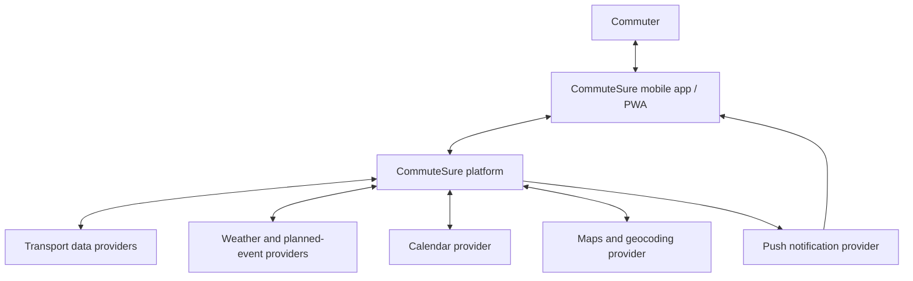
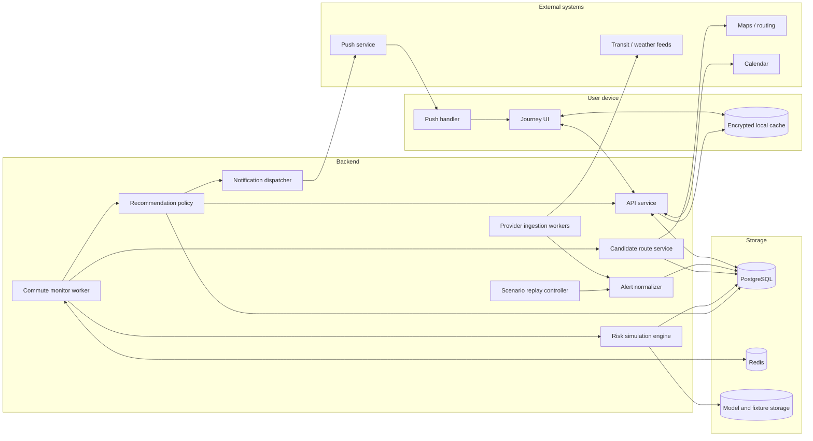
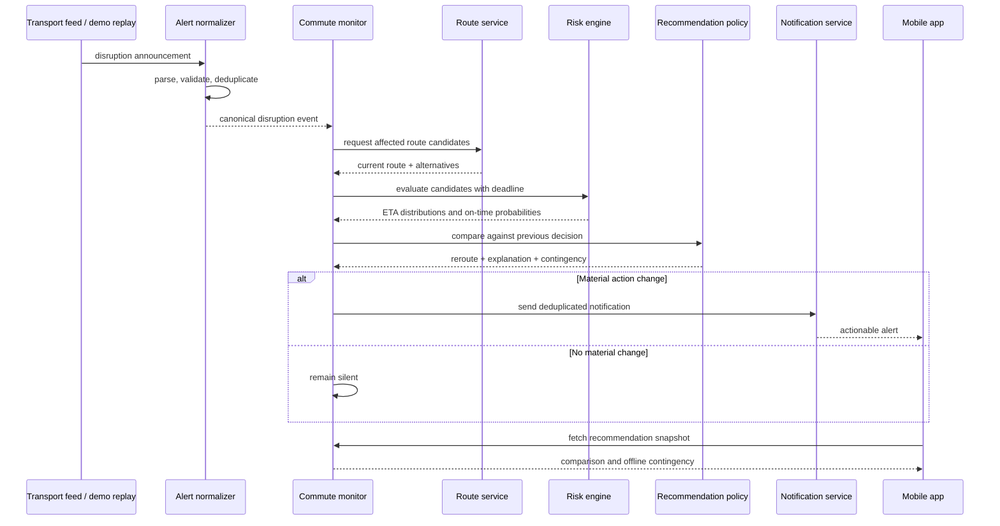
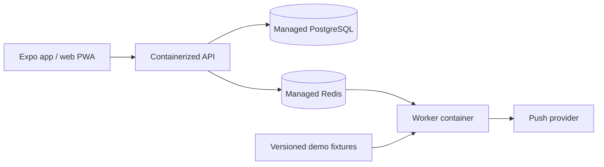

# CommuteSure SG — System Architecture

## 1. Purpose

CommuteSure SG is a deadline-aware commute decision system. Its primary responsibility is to answer:

> Given the user's current journey, deadline, and available evidence, should they stay on the current route or switch to an alternative?

The system produces a recommendation, an estimated probability of arriving on time for each viable route, and a short explanation. It is not intended to replace a full navigation platform in the MVP.

## 2. Architectural goals

- Recalculate a decision quickly when a material disruption occurs.
- Keep external data providers replaceable behind adapters.
- Support both live events and deterministic hackathon replay events.
- Make recommendations reproducible and explainable.
- Continue showing the latest contingency plan without connectivity.
- Avoid duplicate, noisy, or rapidly oscillating notifications.
- Degrade safely when a provider is unavailable or data is stale.

## 3. Context diagram



## 4. Container architecture



For the hackathon, these logical components can run in one API process and one background worker. They are separate boundaries in the design so that expensive simulation, ingestion, and notification delivery can be scaled independently later.

## 5. Core components

### Mobile client or PWA

- Captures saved places, recurring commutes, deadlines, and arrival buffers.
- Shows the recommended route and a small comparison of alternatives.
- Stores the latest signed contingency payload locally.
- Displays data freshness and confidence when live inputs are degraded.
- Registers a push token without exposing calendar credentials to other services.

### API service

- Authenticates the client and enforces resource ownership.
- Exposes commutes, recommendations, route comparisons, and demo controls.
- Validates all inputs at the boundary.
- Returns a consistent recommendation snapshot so the UI does not assemble decisions itself.

### Commute monitor

- Schedules monitoring around a trip's departure window.
- Subscribes to relevant normalized events by line, stop, station, or geographic area.
- Recalculates only when an event can materially affect the active commute.
- Uses idempotency keys to prevent duplicate evaluations.

### Provider ingestion and alert normalizer

- Polls or consumes transport, weather, closure, and maintenance feeds.
- Converts provider payloads into a canonical event model.
- Deduplicates repeated announcements and tracks event revisions.
- Can use an LLM to extract fields from unstructured text, but validates the result against a strict schema.
- Falls back to a deterministic parser or flags the alert for low confidence when extraction fails.

Canonical alert fields include:

```json
{
  "event_id": "provider:event-version",
  "type": "SIGNALLING_FAULT",
  "severity": "MAJOR",
  "affected_entities": ["EWL", "EW12", "EW13"],
  "started_at": "2026-09-19T07:48:00+08:00",
  "expected_end": null,
  "alternatives": ["BUS_BRIDGING"],
  "confidence": 0.91,
  "source_timestamp": "2026-09-19T07:49:00+08:00"
}
```

### Candidate route service

- Requests or constructs a small set of diverse route candidates.
- Avoids returning near-duplicates that differ only by a trivial walking segment.
- Includes transfer effort, walking distance, and accessibility constraints.
- Identifies decision points and the latest useful time for switching.

The MVP should cap evaluation at approximately three candidates: the current route and up to two credible alternatives.

### Probabilistic arrival engine

- Converts every route segment into a travel-time distribution.
- Adjusts affected segments using live observations, alert type, and historical priors.
- Samples end-to-end arrival times with a seeded Monte Carlo simulation.
- Produces percentiles, expected arrival time, on-time probability, and confidence.
- Records the model version, input snapshot, and random seed for replayability.

### Recommendation policy

- Compares the current route with viable alternatives.
- Applies thresholds for lateness risk, minimum benefit, switching cost, and data freshness.
- Adds hysteresis so small input changes do not flip the recommendation repeatedly.
- Produces a concise reason code and user-facing explanation.

### Notification dispatcher

- Sends only when the action changes or risk crosses a configured threshold.
- Deduplicates by commute, decision point, and recommendation version.
- Applies a cooldown unless a materially worse event occurs.
- Never includes sensitive calendar details in lock-screen notification text.

### Scenario replay controller

- Replays timestamped disruption events against a fixed route snapshot.
- Uses a fixed simulation seed so the demo produces repeatable probabilities.
- Supports pause, reset, and jump-to-event controls.
- Calls the same normalization, simulation, and policy paths used by live events.

## 6. Decision flow



## 7. Probability model

### Route representation

A route is an ordered set of segments. Each segment has a mode, endpoints, scheduled or expected duration, uncertainty parameters, and dependencies on transport entities.

```text
Route R = [S1, S2, ... Sn]
ArrivalTime(R) = now + sum(Duration(Si))
```

The initial model can use pragmatic distributions:

- Walking: bounded normal or log-normal distribution.
- Vehicle wait: empirical headway distribution.
- Normal in-vehicle time: log-normal distribution around historical duration.
- Transfer: bounded distribution based on interchange walking and wait time.
- Active disruption delay: survival distribution conditioned on incident type and elapsed duration.

The simulation estimates:

```text
P(on time | route, evidence) = P(ArrivalTime(route) <= target arrival time)
```

The target arrival time is the calendar or user deadline minus the preferred early-arrival buffer.

### Historical disruption learning

For each incident class, store the observed duration, affected line or asset type, time of day, day type, and resolution status. The first model can use empirical duration buckets. A later model can use survival analysis to estimate the probability that a disruption continues for another `t` minutes given that it has already lasted `e` minutes.

### Confidence

Probability and confidence are different values. Confidence should fall when:

- an input is stale;
- the alert parser is uncertain;
- a candidate relies on missing live arrivals;
- historical data for an incident class is sparse; or
- providers disagree.

Low confidence should produce cautious language and may suppress a marginal reroute.

## 8. Recommendation policy

The policy should be explicit and testable. A simple MVP policy is:

```text
recommend alternative when:
  current_on_time_probability < 0.70
  AND alternative_on_time_probability - current_on_time_probability >= 0.15
  AND alternative_on_time_probability >= 0.75
  AND time_to_decision_point > minimum_action_time
  AND data_is_fresh
```

Suggested safeguards:

- **Hysteresis:** require a larger improvement to switch than to remain on the newly selected route.
- **Cooldown:** suppress equivalent notifications for a fixed interval.
- **Switch penalty:** account for extra walking, transfers, accessibility needs, and cognitive cost.
- **Last responsible moment:** identify when the alternative will no longer provide a meaningful advantage.
- **Freshness gate:** never give high-confidence wording using expired observations.

All thresholds belong in configuration and should be visible in demo telemetry.

## 9. Data model

Key entities:

- `User`: preferences, timezone, notification policy.
- `Place`: saved origin or destination with coordinates.
- `CommutePlan`: recurrence, origin, destination, deadline, buffer, accessibility preferences.
- `JourneyInstance`: one dated execution of a commute plan.
- `RouteCandidate`: ordered segments and provider snapshot.
- `TransportEvent`: normalized alert, affected entities, severity, confidence, and freshness.
- `Evaluation`: input snapshot, model version, seed, sampled metrics, and confidence.
- `Recommendation`: selected action, reason code, improvement, expiry, and decision point.
- `NotificationDelivery`: idempotency key, channel, attempt state, and timestamps.

## 10. API surface

Proposed MVP endpoints:

```text
POST   /v1/commute-plans
GET    /v1/commute-plans/{id}
POST   /v1/journeys/{id}/evaluate
GET    /v1/journeys/{id}/recommendation
GET    /v1/journeys/{id}/routes
POST   /v1/devices/push-token
POST   /v1/demo/scenarios/{id}/start
POST   /v1/demo/scenarios/{id}/events/{eventId}/trigger
POST   /v1/demo/scenarios/{id}/reset
```

The demo endpoints must be disabled or separately authorized outside a demo environment.

## 11. Offline contingency payload

The server returns a small, versioned payload for local storage:

```json
{
  "journey_id": "journey_123",
  "generated_at": "2026-09-19T07:51:00+08:00",
  "expires_at": "2026-09-19T09:00:00+08:00",
  "primary_action": "Stay on the East-West Line",
  "contingency": {
    "condition": "No movement for 6 more minutes at Bugis",
    "action": "Exit and take Bus 130",
    "decision_deadline": "2026-09-19T08:06:00+08:00"
  },
  "freshness_note": "Based on information available at 7:51 AM"
}
```

The client must display the generation time and must not silently treat an expired payload as live advice.

## 12. Reliability and failure modes

- Provider outage: serve the latest non-expired snapshot and visibly reduce confidence.
- Duplicate alert: deduplicate using provider ID plus normalized content hash.
- Conflicting alerts: keep both sources, prefer authoritative data, and lower confidence.
- Simulation timeout: return the last valid evaluation or a deterministic approximation.
- Push failure: keep the recommendation available in-app and retry with bounded backoff.
- Calendar failure: preserve manually configured commute plans; do not block routing.
- LLM parse failure: reject invalid structured output and use deterministic extraction or manual demo fixtures.

## 13. Security and privacy

- Use OAuth for calendar access and request the narrowest available scope.
- Encrypt calendar tokens and sensitive profile data at rest.
- Store only the calendar fields required to create a trip; avoid retaining event descriptions or attendee lists.
- Keep precise location history for the shortest practical duration and allow deletion.
- Validate and rate-limit every public API endpoint.
- Treat provider announcements and LLM output as untrusted input.
- Do not expose internal model traces, access tokens, or raw calendar content in notifications.
- Record recommendation inputs and versions without logging secrets or unnecessary personal data.

## 14. Observability

Track:

- provider freshness and ingestion failures;
- evaluation latency and simulation count;
- recommendation changes per journey;
- notification send, deduplication, and failure counts;
- predicted probability versus observed arrival outcome;
- percentage of recommendations suppressed by confidence or policy thresholds.

Every evaluation should have a correlation ID spanning ingestion, routing, simulation, policy, and notification logs.

## 15. Deployment

### Hackathon deployment



Keep the live and replay modes behind the same domain interfaces. If external APIs fail during judging, the replay mode remains deterministic and demonstrates the complete architecture rather than a disconnected mock screen.

### Future scaling

- Partition monitoring jobs by departure window or transport corridor.
- Cache route candidates and invalidate only affected segments.
- Scale simulation workers independently from APIs.
- Move provider ingestion to event streams when volume warrants it.
- Introduce a feature store or model registry only after historical data justifies it.

## 16. Build sequence

1. Define canonical domain models and the Rachel scenario fixture.
2. Implement deterministic route candidates for the demo corridor.
3. Build the seeded probability simulator and policy tests.
4. Expose evaluation and recommendation endpoints.
5. Build the comparison UI and offline contingency cache.
6. Add disruption replay and one deduplicated notification.
7. Integrate a live provider only after the end-to-end replay is reliable.
8. Add calendar and evening briefing if time remains.

## 17. Test strategy

- Unit-test distributions, deadline calculations, thresholds, hysteresis, and deduplication.
- Property-test that probabilities remain between zero and one and tighten with more evidence.
- Integration-test provider normalization and invalid LLM output rejection.
- Contract-test provider adapters using recorded fixtures.
- End-to-end test the Rachel scenario from normal state through disruption and offline fallback.
- Run the demo from a fixed seed and assert the expected recommendation transition.

## 18. Key architecture decisions

- Optimize for on-time probability rather than shortest ETA.
- Keep the LLM outside the final decision path; it may structure alerts, but validated deterministic code calculates risk and applies policy.
- Use a modular monolith for the hackathon, with clear boundaries that can be extracted later.
- Limit route candidates to improve speed, clarity, and explainability.
- Treat deterministic replay as a first-class input source, not a last-minute fallback.
- Defer crowd prediction until the core wait-or-reroute loop is accurate and demonstrable.
